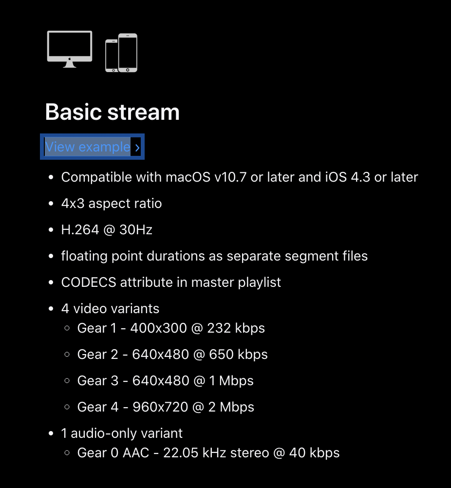

# AVAggregateAssetDownloadTask_Resume
This repo presents simple demo application that shows issues with iOS devices. It is not possible to resume AVAggregateAssetDownloadTask after application termination.

# Issue description:

Unable to resume the `AVURLAsset` download (created with `aggregateAssetDownloadTask`) after application termination.



--------------------------------
How to reproduce the issue:

1) Open AVAggregateAssetDownloadTask.xcodeproj
2) Take iOS device
3) Start debugging AVAggregateAssetDownloadTask
4) Observe download started in logs: `didLoad aggregateAssetDownloadTask [59.86/1800.0]`
5) Terminate the application, before the download is finished
6) Start application again and observe the download is not resumed

## Observed result:
The download is not resumed after the application is restarted.
On older iOS versions observe the followinf error:
```
AVAggregateAssetDownloadTask[329:15754] Task <D19A0662-0C19-429B-A1A9-97C33BDE56C1>.<1> load failed with error Error Domain=NSURLErrorDomain Code=-999 "(null)" UserInfo={NSURLErrorBackgroundTaskCancelledReasonKey=0, NSErrorFailingURLStringKey=https://devstreaming-cdn.apple.com/videos/streaming/examples/bipbop_4x3/bipbop_4x3_variant.m3u8, NSErrorFailingURLKey=https://devstreaming-cdn.apple.com/videos/streaming/examples/bipbop_4x3/bipbop_4x3_variant.m3u8, _NSURLErrorRelatedURLSessionTaskErrorKey=(
    "BackgroundAVAssetDownloadTask <D19A0662-0C19-429B-A1A9-97C33BDE56C1>.<1>"
), _NSURLErrorFailingURLSessionTaskErrorKey=BackgroundAVAssetDownloadTask <D19A0662-0C19-429B-A1A9-97C33BDE56C1>.<1>} [-999]
```

## Expected result:
The download resumes and all delegates with progress are called again.

## Sample code is available also here:

https://github.com/mackode/AVAggregateAssetDownloadTask_Resume